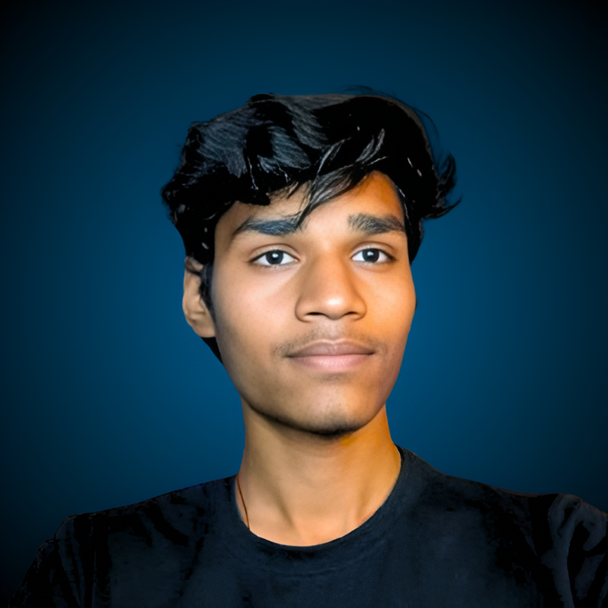

<!DOCTYPE html>
<html lang="en">
<head>
    <meta charset="UTF-8">
    <meta name="viewport" content="width=device-width, initial-scale=1.0">
    <title>Vision for India | CS & Business</title>
    
</head>
<body>
    

    <nav>
        <ul>
            <li><a href="#home">Home</a></li>
            <li><a href="#vision">Vision</a></li>
            <li><a href="#skills">Skills</a></li>
            <li><a href="#projects">Projects</a></li>
            <li><a href="#contact">Contact</a></li>
        </ul>
    </nav>

    <section id="home" class="hero">
        

            

                

                </img>
            

            

                <h1>Prince Kushwaha</h1>
                <h2>Engineering Student • Entrepreneur • Visionary</h2>
                
"I’m passionate about blending technology with business to create impactful solutions. From coding projects in Python and web development to exploring startups, I aim to build ventures that contribute to India’s digital growth and empower communities." meaning of hindi.

                <a href="#contact" class="cta-button">Let's Connect</a>
            

        

    </section>

    <section id="vision">
        <h2>Vision for India</h2>
        

            

                <h3>🚀 Tech Innovation</h3>
                
Sorry to say but right now this information is not awailable.  This section will be update soon...

            

            

                <h3>💼 Startup Ecosystem</h3>
                
Sorry to say but right now this information is not awailable.  This section will be update soon...

            

            

                <h3>🎓 Digital Education</h3>
                
Sorry to say but right now this information is not awailable.  This section will be update soon...

            

            

                <h3>🌱 Sustainable Growth</h3>
                
Sorry to say but right now this information is not awailable.  This section will be update soon...

            

        

    </section>

    <section id="skills">
        <h2>Skills & Expertise</h2>
         <h5 style="text-align: center;"> "Daily Learning to Be Best"</h5>
          
        

            

                <h3>Technical Skills</h3>
                

                    

                        Python & Java
                        50%
                    

                    

                        

                    

                

                

                    

                        Web Development
                        80%
                    

                    

                        

                    

                

                

                    

                        Data Structures & Algorithms
                        75%
                    

                    

                        

                    

                

                

                    

                        upcoming skill
                        working...
                    

                    

                        

                    

                

            

            

                <h3>Business Skills</h3>
                

                    

                        Leadership & Communication
                        99%
                    

                    

                        

                    

                

                

                    

                        Market Research
                        70%
                    

                    

                        

                    

                

                

                    

                        upcoming skill
                        working...
                    

                    

                        

                    

                

                

                    

                        upcoming skill
                        working...
                    

                    

                        

                    

                

            

        

    </section>

    <section id="projects">
        <h2>Projects & Ventures</h2>
        

            

                
💻

                

                    <h3>E-Learning Platforms</h3>
                    
Sorry, this project is not available for everyone right now.  It will be available in the future.
                    

                

            

            

                
🛍️

                

                    <h3>Local Business Apps</h3>
                    
Sorry, this project is not available for everyone right now.  It will be available in the future.

                

            

            

                
📊

                

                    <h3>Data Analytics Tools</h3>
                    
Sorry, this project is not available for everyone right now.  It will be available in the future.

                

            

        

    </section>

    <section id="contact">
        <h2>Let's Build Together</h2>
        

            <form class="contact-form" onsubmit="handleSubmit(event)">
                <input type="text" placeholder="Your Name" required>
                <input type="email" placeholder="Your Email" required>
                <textarea rows="5" placeholder="Your Message" required></textarea>
                <button type="submit">Send Message</button>
            </form>
        

    </section>

    <footer>
        
&copy; 2025 Prince Kushwaha. All rights reserved.

        

            <a href="https://www.linkedin.com/in/prince-kushwaha%E2%9A%9C%EF%B8%8F-a5a815350?utm_source=share&utm_campaign=share_via&utm_content=profile&utm_medium=android_app" title="LinkedIn">LinkedIn</a>
            <!-- <a href="#" title="GitHub">gh</a> -->
            <a href="https://www.instagram.com/princekushwaha.empire/" title="instagram">insta</a>
            <a href="mailto:officialprinceudz@gmail.com" title="Email">email</a>
        

    </footer>

    
</body>
</html>
